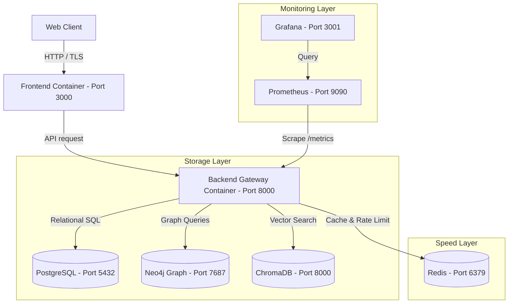

# FilmAura Infrastructure Architecture

This document maps out the system infrastructure, CI/CD pipelines, security middlewares, caching hierarchies, and monitoring patterns.

---

## 1. System Architecture

---

## 2. CI/CD Workflows

GitHub Actions execute checks on three workflows:
1. **Backend Pipeline**:
   - Spawns a PostgreSQL container.
   - Installs dependencies.
   - Compiles app scripts.
   - Runs `pytest` suite.
2. **Frontend Pipeline**:
   - Sets up Node.js.
   - Installs npm modules.
   - Validates TypeScript styles.
   - Compiles Next.js standalone pages.
3. **Release Pipeline**:
   - Validates Docker compilation builds.

---

## 3. Caching and Degradation Logic

If the Redis connection fails or cache is offline, `RedisCacheManager` delegates automatically to `InMemoryCacheManager`.
Likewise, the sliding-window rate limiter will fall back to local dict caches, preventing user request failures.

---

## 4. Security Controls

Security hardening parameters:
- **HTTP Secure Headers**: CSP, HSTS, X-Content-Type-Options, X-Frame-Options are injected via FastAPI middleware.
- **CORS Restricted Origins**: Restricts cross-origin requests to trusted frontends in production mode.
